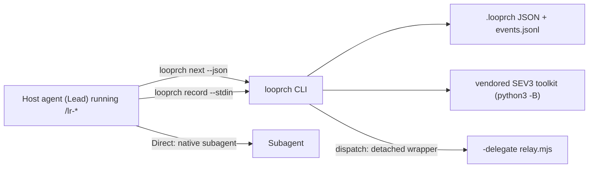

# Architecture

Binding decisions: `research/00_README.md` (D-01 to D-22). This page summarizes what the code
implements.

## Boundaries

| Component | Owns | Does not own |
|---|---|---|
| SEV3 package (in the project) | requirements, phases, gates, `todo.md`, toolkit | execution, state |
| Looprch core (`~/.looprch/current`) | CLI, state machine, skills, role templates, adapters, vendored toolkit | project data |
| Project state (`.looprch/`) | config, state, journal, phase records, evidence | shared logic |
| delegate-skills relays | headless transport to agent CLIs | roles, lifecycle, model choice |
| QuotaLens | observed usage limits | scheduling decisions |

## The step engine

`looprch next` returns exactly one action. The Lead performs it (`dispatch`, `record`,
`gates run`, `checkpoint`, `answer`, `wait`) and asks again. The Lead keeps no workflow state.

## Components and modules

| Component | Module(s) |
|---|---|
| fsx | `src/core/fsx.ts`, `src/core/lock.ts` |
| config (+ migrations) | `src/core/config.ts`, `src/core/migrations.ts` |
| state + journal | `src/core/state.ts`, `src/core/journal.ts`, `src/core/runs.ts` |
| lifecycle | `src/core/lifecycle.ts`, `src/core/preflight.ts`, `src/core/mode.ts`, `src/core/actions.ts`, `src/core/results.ts` |
| briefs | `src/core/briefs.ts`, `assets/roles/*.md`, `assets/templates/brief.md` |
| sev3 | `src/sev3/*` (discovery, trust, fingerprint, packets, todo, toolkit runner, manifest types) |
| gates | `src/gates/runner.ts`, `unittest.ts`, `junit.ts` |
| delegate | `src/delegate/*` (locate, discover, dispatch, result, sessions) |
| quota | `src/quota/quotalens.ts`, `policy.ts` |
| git | `src/git/*` (git, baseline, phase, snapshot) |
| agents | `src/agents/<id>.ts`, `index.ts`, `types.ts` |
| install | `src/install/*` (central, manifest, shim, registry, links, project-files) |
| ui | `src/ui/prompts.ts` |
| CLI surface | `src/cli/*` (one file per command group) |

There is no plugin framework, service layer or dependency injection container. Engine functions
take an `Engine` value (`root`, `cfg`, `st`, `manifest`, `host`, buffered `events`) and the CLI
command persists it under the project lock.

See also: [lifecycle-state-machine.md](lifecycle-state-machine.md),
[shared-vs-project-state.md](shared-vs-project-state.md), [cli-architecture.md](cli-architecture.md).
