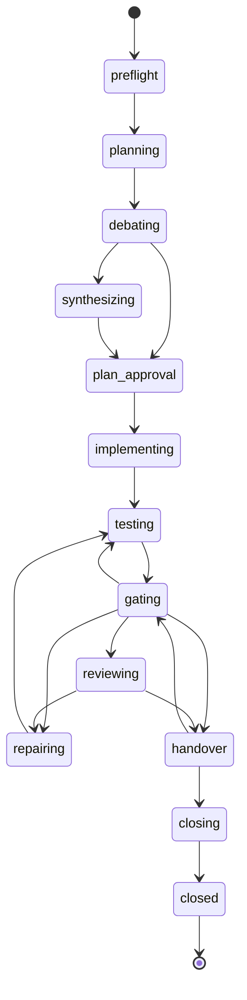

# Lifecycle state machine

Implemented in `src/core/lifecycle.ts`. `next()` evaluates rules in a fixed order and returns
one action; internal transitions (phase start, preflight, closing) happen inside the same call.

`gating --> testing` is the Tester-only round after unbacked verifications. Inside `repairing`,
a repair design runs Planner (`context_answer`), optionally Plan Debater (`design_review`) and
Planner again before the Implementer; it is not a separate stage.

## Evaluation order in next

1. Protocol differs from the phase's protocol → `paused` (`protocol_changed`).
2. `flags.blocked` → `blocked` (durable).
3. `pending_question` → `ask_user` (same question).
4. HEAD guard during a phase: branch must be `looprch/P-NNN` and HEAD the last Looprch commit
   (a Looprch checkpoint committed before a crash is adopted) → otherwise `blocked head_mismatch`.
5. Active run: Delegate running with a live wrapper → `await_run`; finished → record; vanished →
   interrupted → retry. Direct `issued` → the same `run_role` again (attempt+1).
6. Pause requested → `paused`.
7. Waiting until a time → `wait`; afterwards the quota is checked again.
8. Pending checkpoint → `checkpoint`.
9. No current phase → select (or `stop_before_closure`, `project_done`, non-durable
   `phases_remaining`).
10. Stage handler.

## Stage handlers

| Stage | Action / transition |
|---|---|
| preflight | checks (config, fingerprint + verify, toolkit, gate ack → `ask_user ack_gates`, relays and CLIs); git init, identity, baseline (`ask_user commit_baseline`), clean tree, base branch; create phase branch → planning |
| planning | Planner (`planning`). `plan_ready` → plan.md and contract.json (the phase contract must cover every mapped requirement; incoming deferrals from closed phases are an input and must be covered) → debating. `needs_expansion` → expansion packets, same session (limit `expansion_rounds`) |
| debating | Plan Debater once, read-only, on plan.md and contract.json. `findings` (ids stored in `debate_findings`) → synthesizing; `no_findings` → plan_approval |
| synthesizing | same Planner session (`synthesis`, or `revise` after a user revision): full plan and contract; a synthesis dispositions every debate finding → plan_approval |
| plan_approval | if approvals apply: `ask_user approve_plan` (approve / revise). Then checkpoint "plan approved" → implementing |
| implementing / repairing | a repair design in progress (`design`) runs first: Planner `context_answer` (step `design`, a `contract_amendment` that lists every design finding in `resolves`, merged into contract.json) → if the design covers a high or critical finding, or a lineage that already had a design, Plan Debater `design_review` (step `debate`) → on findings, Planner `context_answer` again (step `revise`) → Implementer. Else, if a context request is open: Planner `context_answer` → addendum (optionally an amendment) → Implementer resumes (the repair delta is kept). Implementer `implemented` → checkpoint "implementation" / "repair N" → testing. A repair after a review must return `resolutions` for every finding in its delta, and a `fixed` one must name files changed since `reviewed_tree` (else the re-ask); its `final.md` is added to `repair_reports`. `needs_design` resolutions (once per finding and round) open a repair design, then the same Implementer session repairs again |
| testing | Tester; verdict, `verifications` (merged per id into `tester_verifications`) and manual reports stored → gating. The first run verifies every contract obligation and deferral. After a review repair the Tester gets every finding (it fixes `owner: tester` ones, tries to falsify the rest, returns a verification for each) and the repair reports. A `failed` verification is a tester failure |
| gating | `run_gates`; all gates pass and verdict pass (or, after a review, a `fail` whose failures are all ids the Implementer's latest resolutions report `not_fixed`, `acknowledged_open`: they go to the re-review, not into another test repair) → evidence binding: every `verified` verification's `tests` must match a passing testcase of this gate batch (JUnit, verbose unittest), or without named testcases an existing test file and name (`evidence.checked`). For open review findings, each acceptance check of a verified finding needs cited testcases, and one of them must not have passed on the reviewed tree (`reviewed_cases`; without named testcases, a test file changed since `reviewed_tree`), since a test that passed while the defect existed proves nothing (`evidence.checked` `stale`). Unbacked or stale claims (`evidence.unbacked`) → a test repair for the Tester alone, whose delta keeps the findings' Fix and checks (`test_repairs`+1, the Implementer is skipped). Backed → reviewing (post-run snapshot stored), or handover after a user-chosen unreviewed final repair (`review.skipped`, open findings go into handover.md); else repair (test, `test_repairs`+1) or `blocked repair_limit` when `test_repairs` reached `limits.repair_rounds` + extra rounds |
| reviewing | `final_review_pending` → `ask_user final_review`. Snapshot must equal the gates snapshot (else gating). The brief carries "Review round n of N", the time budget and the diff commands (phase base → gates tree; re-reviews also `reviewed_tree` → gates tree); re-reviews get the open findings as a `rereview` delta and the repair reports. A run's timeout is the Reviewer timeout × (1 + 0.5 × (n − 1)). Round 1 returns `contract_review` for every contract id; re-reviews return `prior` for every earlier finding (see the phase rules in [schemas.md](schemas.md)). Findings go into `finding_ledger` (an `unfixed` re-report keeps its first Fix; `related` joins a lineage). `approve` → handover (findings become `review_notes`, listed in handover.md). `changes_requested` → `review_changes`+1, `reviewed_tree` stored → repair: findings with `owner: tester` (or `cause: test`) only → straight to testing; Implementer findings with `cause` plan, requirement or cross_phase, `origin: unfixed`, or `related` to an earlier lineage first open a repair design (`design.escalated`). If that was the final allowed review (`limits.review_rounds` + `extra_reviews`), `final_review_pending` instead. The final review's `changes_requested` needs a high or critical finding (else the re-ask) |
| final_review answer | `repair_and_review`: `extra_reviews`+1, repair, then one more review. `repair_and_handover`: final repair, tests and gates, then handover without a review. `pause`: paused; asked again after resume. The question names repeated lineages and their repair designs |
| handover | snapshot changed → gating. File lists must equal `git diff --name-status` since the phase base (re-ask once, then `blocked handover_mismatch`) → closing. handover.md gets the contract status (from `contract_review`) and the deferrals to later phases |
| closing | ticks todo.md and verifies; merge approval (`ask_user approve_merge`, hold → paused); final commit, `merge --no-ff`, tag, delete branch → `phase_closed` |

## Cross-cutting on every run

- Mode resolution (D-05): Direct on another host → that agent's relay (`mode_reason
  d05_auto_delegate`); missing relay/CLI → `blocked relay_missing` / `cli_missing`.
- Quota (D-07): exhausted with reset ≤ `quota_wait_minutes` → `wait`; later → next fallback
  (`quota.fallback`); none → wait until the reset. Rate-limit marks: fallback or 15-minute waits,
  `ask_user rate_limit_long` after 4 hours.
- Implementer/Tester agent switch → checkpoint "agent switch" first, then a fresh session with the
  diff since the phase base and earlier final messages.
- Context guard → `ask_user context_over_budget` when a larger-budget fallback exists.

## Cross-cutting on every result

- Invalid block, or a phase rule violation (contract coverage, dispositions, resolutions,
  verifications, review coverage and consistency) → one re-ask in the same session, then
  `blocked result_invalid`.
- Read-only role changed files (or the relay reports a violation) → `blocked readonly_violation`.
- `failed` / `timeout` / `aborted` / interrupted → retry up to `run_attempts`, then fallback, then
  `blocked run_failed`. `*_unavailable` → fallback or `blocked cli_missing`. Exit 2 without a
  result → `blocked usage_error`.

## Action schema

Common: `protocol`, `action`, `phase`, `stage`, `round`, `summary`, optional `command[]`.

| Action | Fields |
|---|---|
| `run_role` | `run_id`, `role`, `task`, `mode`, `mode_reason`, `agent`, `model`, `effort`, `brief`, `packet`, `read_only`, `session{id, resume}`, `attempt`; Delegate: `command`; Direct: `subagent`, `spawn_hint`, `record_command` |
| `await_run` | `run_id`, `poll_after_seconds`, `command` |
| `run_gates` | `command` |
| `checkpoint` | `label`, `command` |
| `wait` | `until`, `reason`, `command` |
| `ask_user` | `question_id`, `kind`, `question`, `options[{id,label}]`, `command_template` |
| `paused` | `reason` |
| `blocked` | `code`, `reason`, `details`, `hint`, `durable` |
| `phase_closed` | `tag`, `merge_commit` |
| `stop_before_closure` | `closure_phase` |
| `project_done` | `report` |

Resume (`looprch resume [--note]`) clears paused/waiting/blocked; after `repair_limit` it grants
one round and the note goes into the next brief (the block is raised in `repairing`, so the
round is a repair, never another review); after `protocol_changed` the phase adopts the
new protocol; `spec_changed` stays until the package verifies with an accepted fingerprint.
