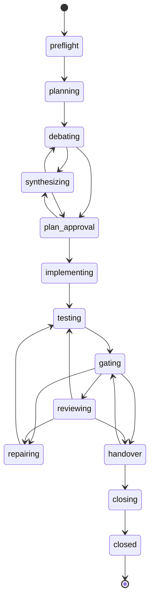

# Lifecycle state machine

Implemented in `src/core/lifecycle.ts`. `next()` evaluates rules in a fixed order and returns
one action; internal transitions (phase start, preflight, closing) happen inside the same call.

`synthesizing --> debating` is the rebuttal: the plan debate repeats until the Debater agrees or
`limits.debate_rounds` is reached (default 2). `plan_approval --> synthesizing` is the user's
"revise" answer. `reviewing --> testing` is a review whose findings all belong to the Tester.
Inside `implementing` and `repairing`, a blocking Implementer question runs the Planner
(`context_answer`) and then the same Implementer session again; it is not a separate stage and
the Plan Debater never sees it.

The debate ledger is `.looprch/phases/P-NNN/debate.json` (`src/core/debate.ts`): the Debater's
findings (`D-n`), each with the Planner's answer and the Debater's verdicts, open until resolved,
conceded, contested or decided by the user.

## Evaluation order in next

1. Protocol differs from the phase's protocol → `paused` (`protocol_changed`).
2. `flags.blocked` → `blocked` (durable).
3. `pending_question` → `ask_user` (same question).
4. HEAD guard during a phase: branch must be `looprch/P-NNN` and HEAD the last Looprch commit
   (a Looprch checkpoint committed before a crash is adopted) → otherwise `blocked head_mismatch`.
5. Active run: Delegate running with a live wrapper → `await_run`; finished → record; vanished →
   interrupted → retry. Direct `issued` → the same `run_role` again (attempt+1).
6. Pause requested → `paused`.
7. Waiting until a time → `wait`; afterwards the quota is checked again.
8. Pending checkpoint → `checkpoint`.
9. No current phase → select (or `stop_before_closure`, `project_done`, non-durable
   `phases_remaining`).
10. Stage handler.

## Stage handlers

| Stage | Action / transition |
|---|---|
| preflight | checks (config, fingerprint + verify, toolkit, gate ack → `ask_user ack_gates`, relays and CLIs); git init, identity, baseline (`ask_user commit_baseline`), clean tree, base branch; create phase branch → planning |
| planning | Planner (`planning`); the brief names the Implementer's agent, model and context budget (`context_kb`). `plan_ready` → plan.md (the guide) and plan.json (todos, sessions, requirement map, deferrals; `plan.accepted`) → debating. Requirements the map does not mention go to the Debater as a hint. `needs_expansion` → expansion packets, same session (limit `expansion_rounds`) |
| debating | Plan Debater. Pass 1 (`debate`): `findings`. Later passes (`rebuttal`): verdicts on the Planner's answers (`resolved`, `conceded`, `upheld`) plus new findings; `agree` closes every open item. Nothing open → plan_approval; open and passes < `debate_rounds` → synthesizing; at the limit: open high/critical → `ask_user debate_unresolved` (keep the Planner's plan / side with the Debater for one last revision / pause), others contested (the first review gets them) |
| synthesizing | same Planner session (`synthesis`, or `revise` after a user revision): the full plan and `debate_dispositions` (`accept` or `reject` with a note) → debating (rebuttal), or straight to plan_approval when only low items are open |
| plan_approval | if approvals apply: `ask_user approve_plan` (approve / revise). Then the sessions are normalized (unknown ids dropped, unlisted todos appended to the last session; notes go to the journal as warnings), checkpoint "plan approved" → implementing |
| implementing | a blocking question open (`context_request`) → Planner `context_answer`: its report is appended to plan.md as `## Addendum N`, `new_todos` join plan.json and the current session → the same Implementer session continues. Else Implementer `implementation` with the delta "Session k of n" and its todos. `implemented` → `todos_done` recorded (no `todos_done` field means the whole session); todos the session left open are queued once as a follow-up session right after it (a follow-up gets no follow-up); `work.done`; checkpoint "implementation" (or "implementation session k"); next session, or testing after the last one |
| repairing | Implementer `repair` with the findings in its delta (a blocking question works as in implementing). `implemented` → `repair_reports`, checkpoint "repair N" → testing |
| testing | Tester; verdict, failures and manual reports stored → gating |
| gating | `run_gates`. The latest runs are reused when every gate already passed on this exact tree with unchanged evidence (`gates.run` `cached`). When the SEV3 gates pass, the optional e2e gate `LR-E2E` runs (enabled, configured, phase selected, tree not already passed; its environment includes `.env.e2e`): exit 1 or a missing report is a failing gate (normal repair), exit 2 → `blocked e2e_config`, exit 3 or timeout → `blocked e2e_environment`, missing binary → `blocked e2e_missing`, other → `blocked e2e_runner`. All gates pass and verdict pass → reviewing (post-run snapshot stored), or handover after a user-chosen unreviewed final repair (`review.skipped`, open findings go into handover.md); else repair (test, `test_repairs`+1) or `blocked repair_limit` when `test_repairs` reached `limits.repair_rounds` + extra rounds (both reset when a review requests changes, so each review cycle has its own budget; `looprch resume` grants one round) |
| reviewing | `final_review_pending` → `ask_user final_review`. Snapshot must equal the gates snapshot (else gating). The brief carries "Review round n of N", the time budget, the diff commands (phase base → gates tree; re-reviews also `reviewed_tree` → gates tree) and `changed-files.txt`; the first review also gets the contested debate items, re-reviews the earlier findings. A run's timeout is the Reviewer timeout × (1 + 0.5 × (n − 1)). `approve` → handover (findings become `review_notes`, listed in handover.md). `changes_requested` → `review_changes`+1, `reviewed_tree` stored → repair: Implementer findings go to the Implementer, `owner: tester` findings to the Tester after it (only Tester findings → straight to testing). If that was the final allowed review (`limits.review_rounds` + `extra_reviews`), `final_review_pending` instead |
| final_review answer | `repair_and_review`: `extra_reviews`+1, repair, then one more review. `repair_and_handover`: final repair, tests and gates, then handover without a review. `pause`: paused; asked again after resume |
| handover | snapshot changed → gating. Looprch appends the file lists from `git diff --name-status` since the phase base, the contributors, the gate runs, the plan's todos and deferrals, and the plan debate → closing |
| closing | ticks todo.md and verifies; merge approval (`ask_user approve_merge`, hold → paused); final commit, `merge --no-ff`, tag, delete branch → `phase_closed` |

## Cross-cutting on every run

- Mode resolution (D-05): Direct on another host → that agent's relay (`mode_reason
  d05_auto_delegate`); missing relay/CLI → `blocked relay_missing` / `cli_missing`.
- Quota (D-07): exhausted with reset ≤ `quota_wait_minutes` → `wait`; later → next fallback
  (`quota.fallback`); none → wait until the reset. Rate-limit marks: fallback or 15-minute waits,
  `ask_user rate_limit_long` after 4 hours.
- Implementer/Tester agent switch → checkpoint "agent switch" first, then a fresh session with the
  diff since the phase base and earlier final messages.
- Context guard → `ask_user context_over_budget` when a larger-budget fallback exists.
- Phase roles run without the agent's read-only mode; only the advisory side runs (Worker,
  `/lr-review`) are read-only, and a side run that changes files is discarded.

## Cross-cutting on every result

- A block Looprch cannot read (no block, invalid JSON, wrong shape or decision, an expansion id
  that is not a SEV3 source) → one re-ask in the same session, then `blocked result_invalid`.
  There are no other result checks.
- `failed` / `timeout` / `aborted` / interrupted → retry up to `run_attempts`, then fallback, then
  `blocked run_failed`. `*_unavailable` → fallback or `blocked cli_missing`. Exit 2 without a
  result → `blocked usage_error`.

## Action schema

Common: `protocol`, `action`, `phase`, `stage`, `round`, `summary`, optional `command[]`.

| Action | Fields |
|---|---|
| `run_role` | `run_id`, `role`, `task`, `mode`, `mode_reason`, `agent`, `model`, `effort`, `brief`, `packet`, `read_only`, `session{id, resume}`, `attempt`; Delegate: `command`; Direct: `subagent`, `spawn_hint`, `record_command` |
| `await_run` | `run_id`, `poll_after_seconds`, `command` |
| `run_gates` | `command` |
| `checkpoint` | `label`, `command` |
| `wait` | `until`, `reason`, `command` |
| `ask_user` | `question_id`, `kind`, `question`, `options[{id,label}]`, `command_template` |
| `paused` | `reason` |
| `blocked` | `code`, `reason`, `details`, `hint`, `durable` |
| `phase_closed` | `tag`, `merge_commit` |
| `stop_before_closure` | `closure_phase` |
| `project_done` | `report` |

Resume (`looprch resume [--note]`) clears paused/waiting/blocked; after `repair_limit` it grants
one round and the note goes into the next brief (the block is raised in `repairing`, so the
round is a repair, never another review); after `protocol_changed` a phase from protocol 4
restarts at planning (its contract, plan and debate files move to `v07/`), then adopts the new
protocol; `spec_changed` stays until the package verifies with an accepted fingerprint.
