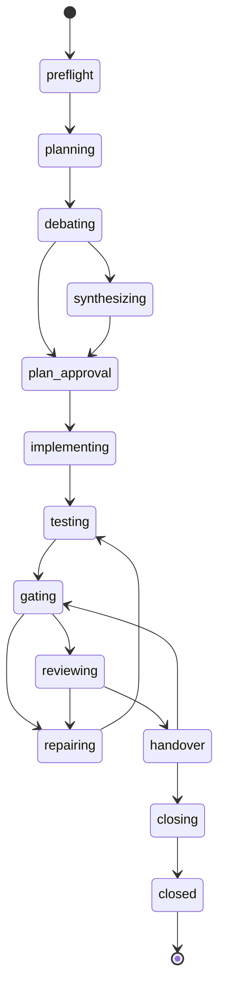

# Lifecycle state machine

Implemented in `src/core/lifecycle.ts`. `next()` evaluates rules in a fixed order and returns
one action; internal transitions (phase start, preflight, closing) happen inside the same call.

## Evaluation order in next

1. Protocol differs from the phase's protocol → `paused` (`protocol_changed`).
2. `flags.blocked` → `blocked` (durable).
3. `pending_question` → `ask_user` (same question).
4. HEAD guard during a phase: branch must be `looprch/P-NNN` and HEAD the last Looprch commit
   (a Looprch checkpoint committed before a crash is adopted) → otherwise `blocked head_mismatch`.
5. Active run: Delegate running with a live wrapper → `await_run`; finished → record; vanished →
   interrupted → retry. Direct `issued` → the same `run_role` again (attempt+1).
6. Pause requested → `paused`.
7. Waiting until a time → `wait`; afterwards the quota is checked again.
8. Pending checkpoint → `checkpoint`.
9. No current phase → select (or `stop_before_closure`, `project_done`, non-durable
   `phases_remaining`).
10. Stage handler.

## Stage handlers

| Stage | Action / transition |
|---|---|
| preflight | checks (config, fingerprint + verify, toolkit, gate ack → `ask_user ack_gates`, relays and CLIs); git init, identity, baseline (`ask_user commit_baseline`), clean tree, base branch; create phase branch → planning |
| planning | Planner (`planning`). `plan_ready` → plan.md → debating. `needs_expansion` → expansion packets, same session (limit `expansion_rounds`) |
| debating | Plan Debater once, read-only. `findings` → synthesizing; `no_findings` → plan_approval |
| synthesizing | same Planner session (`synthesis`, or `revise` after a user revision) → plan_approval |
| plan_approval | if approvals apply: `ask_user approve_plan` (approve / revise). Then checkpoint "plan approved" → implementing |
| implementing / repairing | if a context request is open: Planner `context_answer` → addendum → Implementer resumes. Implementer `implemented` → checkpoint "implementation" / "repair N" → testing |
| testing | Tester; verdict and manual reports stored → gating |
| gating | `run_gates`; all gates pass and verdict pass → reviewing (post-run snapshot stored); else repair (test) or `blocked repair_limit` |
| reviewing | snapshot must equal the gates snapshot (else gating). `approve` → handover; `changes_requested` → repair (review) or `blocked repair_limit` |
| handover | snapshot changed → gating. File lists must equal `git diff --name-status` since the phase base (re-ask once, then `blocked handover_mismatch`) → closing |
| closing | ticks todo.md and verifies; merge approval (`ask_user approve_merge`, hold → paused); final commit, `merge --no-ff`, tag, delete branch → `phase_closed` |

## Cross-cutting on every run

- Mode resolution (D-05): Direct on another host → that agent's relay (`mode_reason
  d05_auto_delegate`); missing relay/CLI → `blocked relay_missing` / `cli_missing`.
- Quota (D-07): exhausted with reset ≤ `quota_wait_minutes` → `wait`; later → next fallback
  (`quota.fallback`); none → wait until the reset. Rate-limit marks: fallback or 15-minute waits,
  `ask_user rate_limit_long` after 4 hours.
- Implementer/Tester agent switch → checkpoint "agent switch" first, then a fresh session with the
  diff since the phase base and earlier final messages.
- Context guard → `ask_user context_over_budget` when a larger-budget fallback exists.

## Cross-cutting on every result

- Invalid block → one re-ask in the same session, then `blocked result_invalid`.
- Read-only role changed files (or the relay reports a violation) → `blocked readonly_violation`.
- `failed` / `timeout` / `aborted` / interrupted → retry up to `run_attempts`, then fallback, then
  `blocked run_failed`. `*_unavailable` → fallback or `blocked cli_missing`. Exit 2 without a
  result → `blocked usage_error`.

## Action schema

Common: `protocol`, `action`, `phase`, `stage`, `round`, `summary`, optional `command[]`.

| Action | Fields |
|---|---|
| `run_role` | `run_id`, `role`, `task`, `mode`, `mode_reason`, `agent`, `model`, `effort`, `brief`, `packet`, `read_only`, `session{id, resume}`, `attempt`; Delegate: `command`; Direct: `subagent`, `spawn_hint`, `record_command` |
| `await_run` | `run_id`, `poll_after_seconds`, `command` |
| `run_gates` | `command` |
| `checkpoint` | `label`, `command` |
| `wait` | `until`, `reason`, `command` |
| `ask_user` | `question_id`, `kind`, `question`, `options[{id,label}]`, `command_template` |
| `paused` | `reason` |
| `blocked` | `code`, `reason`, `details`, `hint`, `durable` |
| `phase_closed` | `tag`, `merge_commit` |
| `stop_before_closure` | `closure_phase` |
| `project_done` | `report` |

Resume (`looprch resume [--note]`) clears paused/waiting/blocked; after `repair_limit` it grants
one round and the note goes into the next brief; after `protocol_changed` the phase adopts the
new protocol; `spec_changed` stays until the package verifies with an accepted fingerprint.
