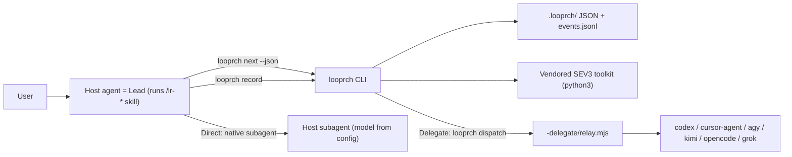

# 01 — Architecture

## 1. Boundaries

| Component | Owns | Does not own |
|---|---|---|
| SEV3 (external ChatGPT skill) | The project definition: requirements, contracts, phases, gates, research, `todo.md`, toolkit | Execution, state, agents |
| Looprch core (central install) | CLI, state machine, skills, role templates, agent adapters, vendored SEV3 toolkit, schemas | Any project's data |
| Project Looprch state (`<project>/.looprch/`) | Config, execution state, journal, phase records, evidence | Shared logic |
| delegate-skills (external) | Headless transport to agent CLIs (`relay.mjs`, `result.json`) | Roles, lifecycle, model choice |
| Agent integration files (per selected agent) | Making `/lr-*` commands and Direct subagents available in that agent | Logic (they only point at the core) |
| Agent runtime sessions | Conversation context inside an agent | Truth (durable artifacts are truth) |
| QuotaLens (external, optional at runtime) | Observed usage limits and reset times | Scheduling decisions |

Looprch never re-implements SEV3 reading/validation, delegate transport, or agent-native features.

## 2. Two surfaces

1. **Shell CLI `looprch`** (deterministic). Installation, project attachment, doctor, status,
   state transitions, brief assembly, gate execution, delegate dispatch, git operations.
2. **Agent skills `/lr-*`** (LLM-facing). Markdown instructions executed by the host agent, which
   acts as the **Lead**. Skills tell the Lead to call the CLI and follow its output.

## 3. Core design: the step engine



- `looprch next --json` returns exactly one action, for example:
  `{"action":"run_role","run_id":"P-003-implementer-2","role":"implementer","mode":"delegate",
  "agent":"opencode","brief":".looprch/runs/P-003-implementer-2/brief.md","session":"ses_…"}`.
  Other actions: `run_gates`, `checkpoint`, `wait {until, reason}`, `ask_user {question}`,
  `paused`, `blocked {reason}`, `phase_closed`, `stop_before_closure`, `project_done`.
- For `mode: delegate` the Lead simply runs `looprch dispatch <run_id>` (the CLI calls the relay and
  records the result itself). For `mode: direct` the Lead spawns its native subagent with the brief
  and pipes the subagent's final message into `looprch record <run_id> --stdin`.
- Gates are run by the CLI (`looprch next` returns `run_gates`; the Lead runs `looprch gates run`),
  never trusted from an agent's claim.
- Restart safety: a new chat, a different host, a terminal or machine restart all resume by
  running `looprch next`. The Lead's context is disposable.
- One **brief** format for both modes: role template + phase/role packet path + task + prior
  findings + output contract. Direct and Delegate differ only in delivery.

## 4. Components (each must justify itself)

| Module | Why it exists |
|---|---|
| `fsx` (atomic write, lock) | Crash-safe state without a database |
| `config` (+ migrations) | Persist role/agent/model choices once; validate; migrate on schema change |
| `state` + `journal` | Explicit, inspectable execution state and history |
| `lifecycle` | The deterministic phase state machine (`next`, `record`) |
| `briefs` | Assemble role inputs from core templates and SEV3 packets |
| `sev3` | Discovery, toolkit trust, validate, fingerprint, packets, todo updates |
| `gates` | Run argv gates, parse unittest/JUnit evidence, bind to git tree |
| `delegate` | Locate relays, build argv, parse `result.json`, sessions, read-only checks |
| `quota` | Read QuotaLens JSON, apply the wait/fallback policy |
| `git` | init, baseline, phase branches, checkpoints, merge, tags (git CLI via `execFile`) |
| `agents/<id>` | One small data-and-generator object per agent |
| `install` | Central install, shim, update, rollback, project registry, link/copy refresh |
| `ui` | `@clack/prompts` wrappers for `add`, confirmations |

No plugin framework, no service layer, no dependency injection container.

## 5. Looprch source repository layout

```text
looprch/                      (this repo, Looprch-4)
  package.json                name "looprch", bin {"looprch": "dist/looprch.mjs"}, engines node>=22
  tsconfig.json
  install.sh                  curl | sh entry; checks prerequisites, runs npx looprch@<v> install
  src/
    cli/                      one file per command (add.ts, update.ts, next.ts, ...)
    core/                     fsx, config, migrations, state, journal, lock, lifecycle, briefs
    sev3/                     discovery, trust, packets, todo, fingerprint
    gates/                    runner, unittest parser, junit parser
    delegate/                 relay locate, dispatch, result parsing, sessions
    quota/                    quotalens adapter and policy
    git/                      git operations
    agents/                   codex.ts cursor.ts agy.ts kimi.ts hermes.ts opencode.ts grok.ts index.ts
    install/                  central install, shim, registry, link/copy
  assets/
    skills/lr-*/SKILL.md      the /lr-* commands (symlinked into projects)
    roles/*.md                role templates used to assemble briefs
    templates/                agents-md-block.md, handover.md, plan.md, ...
  vendor/sev3-toolkit/1.2.0/  byte-identical SEV3 tools + SHA256SUMS
  schemas/                    config.schema.json, state.schema.json, events.schema.json (docs + tests)
  test/                       unit/, integration/, e2e/, fixtures/ (notes-spec copy, fake relays, fake CLIs)
  docs/user/  docs/dev/
  README.md  CHANGELOG.md  LICENSE (MIT)  AGENTS.md (for agents working on Looprch itself)
```

Build: `tsc --noEmit` for types, `esbuild` bundles `src/cli/main.ts` and `@clack/prompts` into
`dist/looprch.mjs`. The npm package ships `dist/`, `assets/`, `vendor/`, `schemas/`, `install.sh`.
